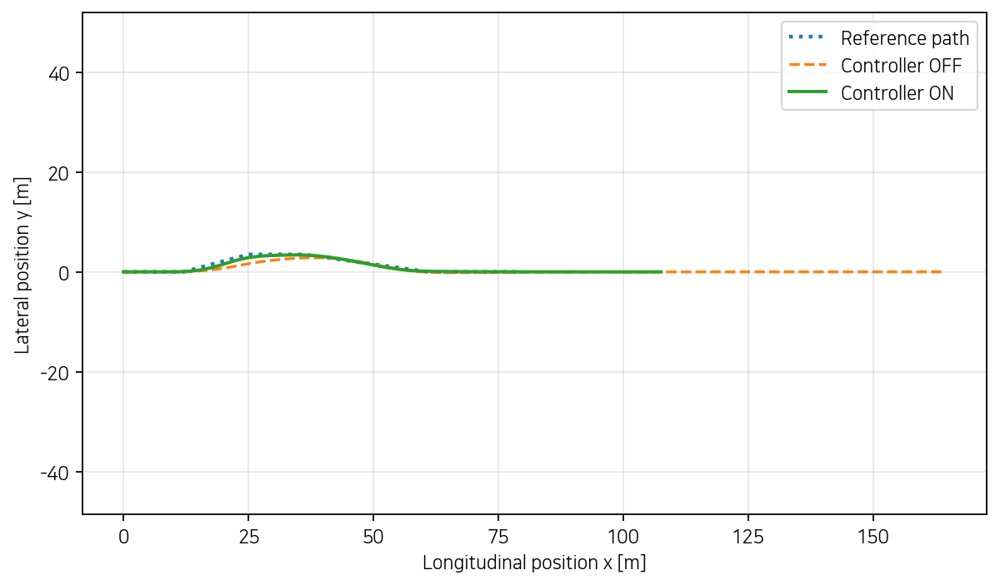
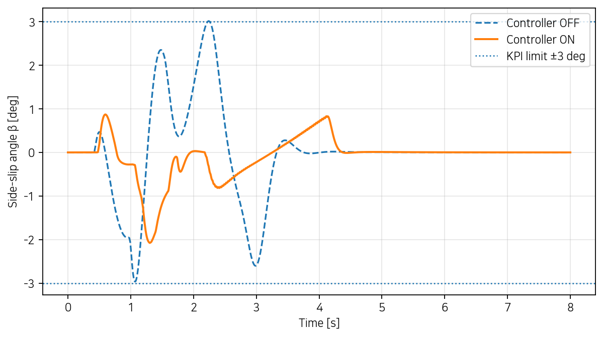
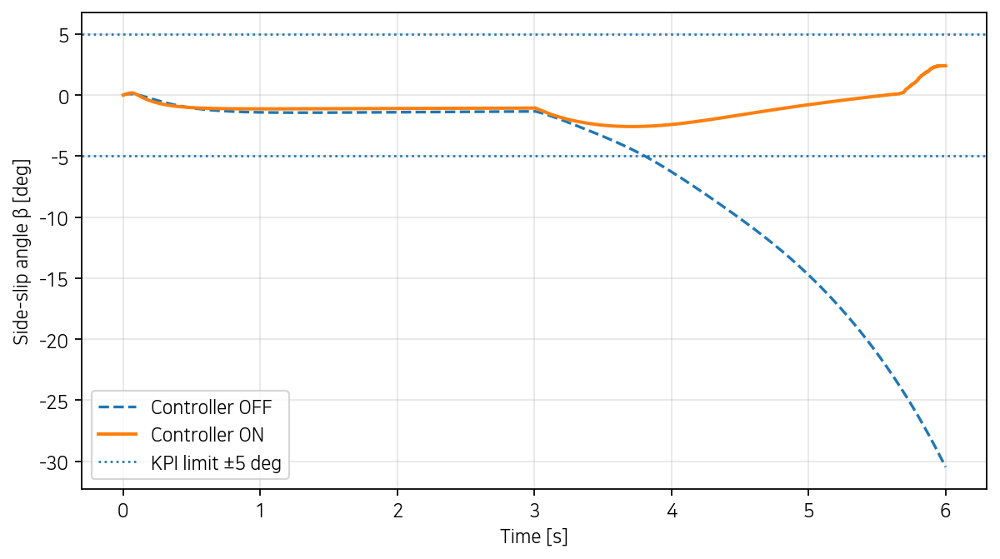
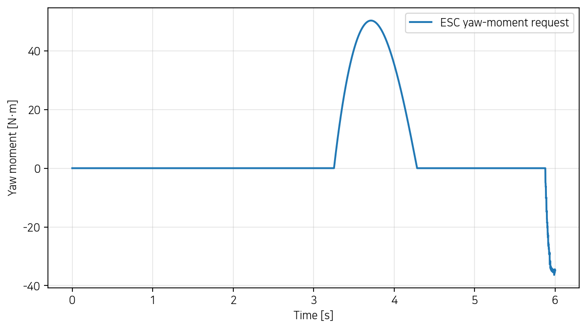
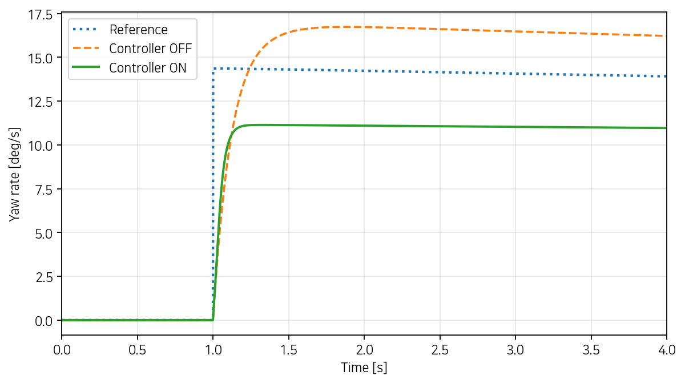
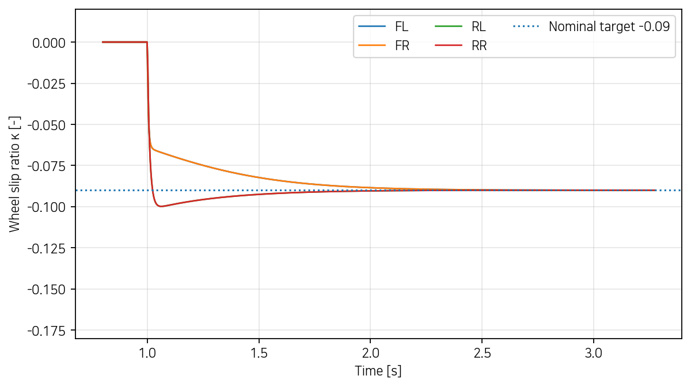

# [202220959-김건희] ICC 제어기 설계 보고서

**과목**: 자동제어 — 2026 봄  
**제출일**: 2026-06-22  
**팀**: 개인

---

## 1. 설계 개요 (1 페이지)

본 과제의 목표는 제공된 14DOF 차량 모델에 횡방향, 종방향, 수직방향 제어기를 구성하고, 이를 하나의 coordinator에서 통합하여 여섯 개 P1 시나리오의 핵심 KPI를 개선하는 것이다. 구체적으로 A3 step steer에서는 yaw-rate 과도응답을 개선하고, A1 double lane change와 D1 DLC+brake에서는 side-slip angle, LTR, 경로 이탈을 제한하며, A7 brake-in-turn에서는 제동 중 발생하는 차량 불안정성을 억제하고, B1 straight braking에서는 wheel lock을 방지하면서 정지거리를 줄이는 것을 목표로 하였다. 최종 검증은 제공된 14DOF standalone plant에서 수행하였다.

제어기는 단일 고정 gain 대신 운전 상태에 따라 제어 권한을 조절하는 **gain scheduling** 구조를 선택하였다. 횡방향에는 P형 AFS와 stability-envelope ESC를 결합하였고, 종방향에는 속도 PI와 4륜 PI ABS를 적용하였다. 수직방향에는 semi-active skyhook CDC를 사용하였으며, coordinator에서는 전후 제동 배분과 one-sided differential braking으로 yaw moment를 구현하였다. 14DOF plant에는 타이어 포화와 횡·종 결합이 포함되므로 단일 선형 설계점의 LQR보다, yaw-rate error, side-slip angle, wheel slip 등 물리적으로 해석 가능한 상태를 이용하고 saturation과 operating-point scheduling을 직접 포함하는 방식이 전체 시나리오에서 더 안정적이라고 판단하였다 [3], [4].

각 제어기의 한 줄 요약은 다음과 같다.

- **ctrl_lateral**: gain-scheduled P형 AFS로 yaw rate를 추종하고, side-slip/yaw-rate envelope 기반 ESC로 차량 안정성을 제한하였다.
- **ctrl_longitudinal**: 속도 PI와 고속 안정성 supervisor를 사용하고, 4륜 PI ABS로 wheel slip을 목표값 근처에 유지하였다.
- **ctrl_vertical**: semi-active on-off skyhook 제어와 1차 필터로 각 wheel corner의 감쇠계수를 결정하였다.
- **ctrl_coordinator**: 종방향 제동은 58:42 전후 배분, ESC yaw moment는 90:10 전후 배분과 one-sided differential braking으로 구현하였다.

---

## 2. 수학적 모델링 (1-2 페이지)

### 2.1 사용한 plant 단순화

최종 평가는 14DOF plant에서 수행되지만, 제어기 설계와 물리적 해석에는 보다 단순한 모델을 사용하였다. 횡방향 제어에는 차체의 횡속도와 yaw rate를 상태로 하는 2DOF bicycle model을 사용하였다. 이 모델은 좌우 타이어를 앞축과 뒤축으로 합치고, small-angle 및 선형 cornering stiffness를 가정한다. 종방향 제어에는 차체 속도와 각 바퀴의 회전동역학을 이용한 wheel-slip 모델을 사용하였다. 수직방향 제어에는 각 corner의 sprung/unsprung velocity와 damper relative velocity를 이용한 quarter-car 개념을 적용하였다.

제어기 설계용 단순 모델과 실제 검증 plant를 분리한 이유는, 14DOF 전체 모델을 직접 이용하면 gain의 물리적 의미와 tuning 방향을 파악하기 어렵기 때문이다. 단순 모델에서 제어 방향과 기본 gain 범위를 결정한 뒤, 실제 14DOF 시뮬레이션의 KPI를 반복 확인하며 최종 gain을 조정하였다.

### 2.2 State-space 표현

2DOF bicycle model의 상태와 입력은

$$
 x=\begin{bmatrix}v_y&r\end{bmatrix}^{T},\qquad u=\delta
$$

로 정의하였다. 여기서 $v_y$는 차체 횡속도, $r$은 yaw rate, $\delta$는 road-wheel steering angle이다. 상태방정식은

$$
\dot{x}=A(V_x)x+B_\delta\delta+B_M M_z,\qquad y=Cx+Du
$$

이며,

$$
A(V_x)=
\begin{bmatrix}
-\dfrac{C_f+C_r}{mV_x} & \dfrac{l_rC_r-l_fC_f}{mV_x}-V_x \\
\dfrac{l_rC_r-l_fC_f}{I_zV_x} & -\dfrac{l_f^2C_f+l_r^2C_r}{I_zV_x}
\end{bmatrix},
$$

$$
B_\delta=
\begin{bmatrix}
C_f/m\\ l_fC_f/I_z
\end{bmatrix},\qquad
B_M=
\begin{bmatrix}
0\\
1/I_z
\end{bmatrix}.
$$

사용된 일반 차량 파라미터는 $m=1500\,\mathrm{kg}$, $I_z=2500\,\mathrm{kg\,m^2}$, $l_f=1.2\,\mathrm{m}$, $l_r=1.4\,\mathrm{m}$, $C_f=80,000\,\mathrm{N/rad}$, $C_r=85,000\,\mathrm{N/rad}$이다. $V_x=22.22\,\mathrm{m/s}$에서 수치 행렬은 대략

$$
A=
\begin{bmatrix}
-4.950 & -21.532\\
0.414 & -5.072
\end{bmatrix},
\qquad
B_{\delta}=
\begin{bmatrix}
53.333\\
38.400
\end{bmatrix}
$$


이다. Side-slip angle은 small-angle 영역에서 $\beta\simeq v_y/V_x$로 근사하였다.

정상상태 yaw-rate reference는 understeer gradient를 포함하여

$$
K_{us}=\frac{ml_r}{2C_fL}-\frac{ml_f}{2C_rL},\qquad
r_{ref}=\frac{V_x\delta_d}{L+K_{us}V_x^2}
$$

로 계산하였다. 제어기에서는 반대로

$$
\hat\delta_d=r_{ref}\frac{L+K_{us}V_x^2}{V_x}
$$

를 사용하여 추정 운전자 조향각을 얻고, 이를 normal/high-authority mode를 구분하는 scheduling 변수로 사용하였다.

종방향 slip ratio는

$$
\kappa_i=\frac{R_w\omega_i-V_{x,i}}{\max(|V_{x,i}|,\epsilon)}
$$

로 정의하였다. 제동 시 $\kappa_i<0$이며 바퀴 회전동역학은

$$
I_w\dot\omega_i=R_wF_{x,i}-T_{b,i}
$$

로 나타낼 수 있다. 속도 제어는

$$
F_{x,cmd}=K_{pv}(V_{x,ref}-V_x)+K_{iv}\int(V_{x,ref}-V_x)dt
$$

로 구성하였고, 최대 jerk를 고려하여 force command의 sample 간 변화량을 제한하였다.

### 2.3 가정 + 한계

- 횡방향 설계 모델에서는 종속도 $V_x$가 한 sample 동안 일정하다고 가정하였다.
- Bicycle model은 좌우 타이어를 축 단위로 합치며, 선형 타이어와 small-slip 영역을 가정한다.
- 횡·종·수직 제어기는 독립적으로 계산되지만, 실제 actuator command는 coordinator에서 결합되므로 14DOF 검증에서는 coupling이 발생한다.
- ABS 설계에서는 brake hydraulic delay와 wheel-speed sensor noise를 생략하였다.
- Skyhook CDC는 sprung/unsprung velocity가 사용 가능하다고 가정하였다.
- 외부 CarMaker BMW 5 parameter file이 없는 환경에서는 generic parameter set으로 초기화되므로, 실차 적용 시에는 gain 재조정이 필요하다.

---

## 3. 제어기 설계 (3-4 페이지)

### 3.1 ctrl_lateral — AFS + ESC

**설계 목표**

- A3 yaw-rate overshoot $<10\%$, rise time $<0.3\,\mathrm{s}$, settling time $<0.8\,\mathrm{s}$
- A1/D1에서 side-slip angle, LTR, lateral deviation 제한
- A7 제동 중 side-slip 발산 방지
- 작은 정상 선회에서는 불필요한 ESC 개입 최소화

**선택 기법**: gain-scheduled P형 AFS + stability-envelope ESC

Yaw-rate error는

$$e_r=r_{ref}-r$$

로 정의하였다. 정상 operating point에서 AFS 보조 조향은

$$
\delta_{AFS}=\mathrm{sat}\left[g_v(V_x)
\left(K_pe_r+K_i\int e_rdt+K_d\dot e_r\right)-K_{\beta s}\beta\right]
$$

로 계산하였다. 속도 schedule은

$$
g_v(V_x)=\mathrm{sat}_{[0.45,1.35]}\left(\frac{V_x}{20}\right)
$$

이다. 초기에는 PI와 PID gain을 함께 시험했으나, 적분항은 operating point 전환 시 누적 오차를 만들고 미분항은 yaw-rate 변화와 수치 noise에 민감하였다. A3에서 P 제어만으로도 과도응답 목표를 충분히 만족하여 최종 normal mode는 $K_p=0.30$, $K_i=K_d=0$으로 정하였다.

추정 운전자 조향각이 $8^\circ$를 넘으면 high-authority mode를 사용한다. 이때 $K_p=-0.20$을 적용하여 큰 조향에서 과도한 yaw response를 억제하는 counter-steer 방향의 보조 조향을 만들었다. Normal mode와 high-authority mode의 최대 보조 조향은 각각 $10^\circ$, $7^\circ$로 제한하였다.

ESC yaw moment는 yaw-rate와 side-slip envelope 초과량을 이용해

$$
M_z=-K_r\left(r-\mathrm{sat}_{[-r_{lim},r_{lim}]}(r)\right)
-K_\beta\mathrm{sgn}(\beta)(|\beta|-\beta_{th})_+
$$

로 계산하였다. 정상 모드에서는 $\beta_{th}=2.0^\circ$, $r_{lim}=0.38\,\mathrm{rad/s}$를 사용하고, high-authority mode에서는 $\beta_{th}=2.5^\circ$, $r_{lim}=0.58\,\mathrm{rad/s}$를 사용하였다. 작은 정상상태 선회에서는 envelope 안에 있으므로 ESC가 거의 개입하지 않고, A7과 D1처럼 차량이 불안정해질 때만 큰 yaw moment를 발생시킨다.

**최종 게인 + 정당화**

```matlab
CTRL.LAT.Kp                = 0.30;
CTRL.LAT.Ki                = 0.00;
CTRL.LAT.Kd                = 0.00;
CTRL.LAT.steerAddMax       = deg2rad(10);
CTRL.LAT.betaThreshold     = deg2rad(2.0);
CTRL.LAT.betaMomentGain    = 5.0e3;
CTRL.LAT.yawStabilityLimit = 0.38;
CTRL.LAT.yawStabilityGain  = 1.20e5;
CTRL.LAT.yawMomentMax      = 8.0e3;

CTRL.LAT.highAuthorityThreshold = deg2rad(8.0);
CTRL.LAT.highKp                  = -0.20;
CTRL.LAT.highSteerAddMax         = deg2rad(7.0);
CTRL.LAT.highBetaThreshold       = deg2rad(2.5);
CTRL.LAT.highBetaMomentGain      = 4.0e5;
CTRL.LAT.highYawStabilityLimit   = 0.58;
CTRL.LAT.highYawStabilityGain    = 2.0e5;
CTRL.LAT.highYawMomentMax        = 1.0e4;
```

큰 조향 중에는 common braking을 0.54배로 제한하는 `brakeScale`을 coordinator로 전달하였다. 이는 직접적인 friction-circle 최적화는 아니지만, 횡력 요구가 큰 구간에서 종방향 제동이 타이어 힘을 모두 사용하는 것을 방지하는 간단한 brake blending이다.

### 3.2 ctrl_longitudinal — 속도 + ABS

**설계 목표**

- B1 정지거리 감소와 ABS slip RMS $<0.1$
- 제동 중 각 바퀴의 wheel lock 방지
- A1/D1 고속 기동에서 과도한 LTR과 경로 이탈 완화
- force command와 ABS correction의 saturation 및 anti-windup 적용

**선택 기법**: 속도 PI + 고속 speed-envelope supervisor + 4륜 PI ABS

속도 PI는

$$
F_{x,cmd}=K_{pv}e_v+K_{iv}\int e_vdt,\qquad e_v=V_{x,ref}-V_x
$$

로 구성하였다. $K_{pv}=500$, $K_{iv}=50$을 사용하고 integral state는 $\pm5000$으로 제한하였다. 등가 질량 $1500\,\mathrm{kg}$과 $LIM.MAX\_JERK$를 사용하여 force command의 변화율도 제한하였다.

고속 handling operating point를 안정화하기 위해 reference speed가 $18$–$25\,\mathrm{m/s}$ 범위일 때 supervisor를 활성화하였다. 차량 속도가 $15.8\,\mathrm{m/s}$보다 높으면 제동을 유지하고 $15.3\,\mathrm{m/s}$ 아래에서 해제하여 $0.5\,\mathrm{m/s}$ hysteresis를 만들었다. 이는 시나리오 ID가 아니라 reference speed를 이용한 operating-point schedule이다.

일반 제동에서 목표 slip은 $\kappa^{*}=-0.09$로 두었다. 각 바퀴별 ABS correction은 다음과 같다.

$$
\Delta T_{b,i}
=
K_{p\kappa}\left(\kappa_i-\kappa^{*}\right)
+
K_{i\kappa}\int
\left(\kappa_i-\kappa^{*}\right)\,dt
$$

이때 $K_{p\kappa}=1.2\times10^4$, $K_{i\kappa}=4.0\times10^4$를 사용하였다. High-speed supervisor가 활성화된 경우에는 목표 slip $-0.05$와 더 큰 gain $(3.0\times10^4,7.0\times10^4)$을 사용하였다. 감속도와 같은 축의 두 바퀴 slip을 동시에 확인하여 ABS를 latch하고, supervisor 제동 해제 직후에는 적분기를 초기화하여 불필요한 재-latch를 막았다.

**최종 게인 + 정당화**

```matlab
CTRL.LON.Kp              = 500;
CTRL.LON.Ki              = 50;
CTRL.LON.intMax          = 5000;
CTRL.LON.absTarget       = -0.09;
CTRL.LON.absKp           = 1.20e4;
CTRL.LON.absKi           = 4.00e4;
CTRL.LON.absReleaseMax   = 2500;
CTRL.LON.absAddMax       = 1800;
CTRL.LON.absEnableAx     = -0.50;
CTRL.LON.absSlipTrigger  = -0.02;
CTRL.LON.stabilitySpeedCap      = 15.3;
CTRL.LON.stabilityBrakePerWheel = 3000;
CTRL.LON.stabilityAbsTarget     = -0.05;
CTRL.LON.stabilityAbsKp         = 3.00e4;
CTRL.LON.stabilityAbsKi         = 7.00e4;
```

### 3.3 ctrl_vertical — CDC

**설계 목표**

- Semi-active damper가 에너지를 주입하지 않도록 dissipative condition 만족
- Sprung-mass 운동 억제
- 감쇠계수 switching을 완화하여 다른 제어기와 안정적으로 통합

**선택 기법**: force-form on-off skyhook + 1차 command filter

각 corner에서 damper relative velocity를

$$
\dot z_{rel,i}=\dot z_{s,i}-\dot z_{u,i}
$$

로 정의하였다. $\dot z_{s,i}\dot z_{rel,i}>0$이면 높은 damping이 sprung-mass 운동을 억제하는 방향이므로

$$
c_i^*=\mathrm{sat}_{[c_{min},c_{max}]}
\left(c_{sky}\frac{|\dot z_{s,i}|}{\max(|\dot z_{rel,i}|,\epsilon)}\right)
$$

를 사용하고, 그 외에는 $c_{min}$을 사용하였다. 최종 command에는 $\tau=0.02\,\mathrm{s}$ 1차 필터를 적용하였다.

```matlab
CTRL.VER.cMin      = 500;
CTRL.VER.cMax      = 5000;
CTRL.VER.skyGain   = 2500;
CTRL.VER.filterTau = 0.02;
```

P1에는 승차감 KPI가 직접 포함되지 않으므로 CDC만의 gain은 별도로 점수화되지 않았다. 다만 A1, A7, D1의 14DOF benchmark에서 다른 제어기와 동시에 오류 없이 실행되는 것을 확인하였다.

### 3.4 ctrl_coordinator — Actuator Allocation

Coordinator는 AFS steering, longitudinal common braking, high-speed supervisor braking, per-wheel ABS correction, ESC differential braking, CDC command를 하나의 actuator command로 통합한다.

종방향 braking force는 wheel radius를 이용해 총 torque로 변환한다.

$$T_{b,total}=-F_xR_w$$

전후 배분은 58:42로 설정하여

$$
T_{FL}=T_{FR}=0.58\frac{T_{b,total}}{2},\qquad
T_{RL}=T_{RR}=0.42\frac{T_{b,total}}{2}
$$

로 계산하였다. ESC yaw moment는 전륜 90%, 후륜 10%로 나누고 half-track을 lever arm으로 사용하였다.

$$
T_f=\frac{|M_z|\alpha_fR_w}{t_f/2},\qquad
T_r=\frac{|M_z|(1-\alpha_f)R_w}{t_r/2},\qquad \alpha_f=0.90
$$

$M_z>0$이면 왼쪽 wheel에, $M_z<0$이면 오른쪽 wheel에 제동 torque를 추가하는 one-sided differential braking을 적용하였다. 종방향 torque, supervisor torque, ABS correction, ESC torque를 모두 합한 후 wheel당 $\pm3000\,\mathrm{N\,m}$로 saturation하였다. ABS correction의 음수값은 nominal braking torque를 줄이는 release command로 해석하였다.

```matlab
CTRL.COORD.frontBrakeBias = 0.58;
CTRL.COORD.escFrontRatio  = 0.90;
```

본 설계는 WLS를 직접 풀지는 않고 전후 bias, brake blending, torque saturation으로 allocation을 구현하였다. 따라서 구현은 단순하지만 wheel별 friction ellipse를 명시적으로 제한하지 못하는 한계가 있다.

---

## 4. 시뮬레이션 결과 (2-3 페이지)

### 4.1 P1 시나리오 benchmark — 베이스라인 vs 본인 설계

최종 결과는 `run('scripts/run_icc_benchmark.m')`과 `run('scripts/grade.m')`으로 확인하였다. 모든 시나리오는 14DOF plant, controller OFF/ON 조건에서 실행하였고 적분기는 fixed-step RK4를 사용하였다. 낮을수록 좋은 KPI의 개선율은

$$
\Delta\%=\frac{KPI_{OFF}-KPI_{ON}}{|KPI_{OFF}|}\times100
$$

으로 계산하였다.

| 시나리오 | KPI | OFF | ON (본인) | Δ% |
|---|---|---:|---:|---:|
| A1 DLC | sideSlipMax [°] | 3.0154 | **2.0777** | -31.1% |
| A1 | LTR_max | 0.8635 | **0.5932** | -31.3% |
| A1 | lateralDevMax [m] | 1.8270 | **0.6455** | -64.7% |
| A3 step | yawRateOvershoot [%] | 2.6997 | **1.4110** | -47.7% |
| A3 | yawRateRiseTime [s] | 0.2470 | **0.0860** | -65.2% |
| A3 | yawRateSettling [s] | 1.4620 | **0.1370** | -90.6% |
| A4 SS | understeerGradient | 0.000749 | **0.000748** | -0.1% |
| A4 | sideSlipMax [°] | 1.1839 | **1.1819** | -0.2% |
| A7 BIT | sideSlipMax [°] | 30.4776 | **2.5760** | -91.5% |
| A7 | LTR_max | 0.6808 | **0.3344** | -50.9% |
| B1 brake | stoppingDistance [m] | 72.3001 | **62.8673** | -13.0% |
| B1 | absSlipRMS | 0.7278 | **0.0652** | -91.0% |
| D1 통합 | sideSlipMax [°] | 4.9058 | **2.0777** | -57.6% |
| D1 | LTR_max | 0.8635 | **0.5932** | -31.3% |
| D1 | lateralDevMax [m] | 1.8270 | **0.6455** | -64.7% |

`grade.m`의 로컬 출력은 B1 정지거리 목표가 이전 기준인 $40\,\mathrm{m}$로 남아 있어 65/70이었다. 그러나 6월 22일 공지된 최종 기준은 $66.5\,\mathrm{m}$이고, 본 결과는 $62.8673\,\mathrm{m}$이므로 공지 기준으로는 모든 상세 KPI 목표를 만족한다.

### 4.2 핵심 plot — A1 DLC



*Figure 4.1 — A1 ISO 3888-1 DLC, 차량 trajectory의 controller OFF/ON 비교.*

A1에서 최대 경로 이탈은 $1.8270\,\mathrm{m}$에서 $0.6455\,\mathrm{m}$로 64.7% 감소하였다. High-authority counter-steer, yaw-rate/side-slip envelope, speed preconditioning이 함께 작동하면서 lane-change 구간에서 차량의 과도한 yaw motion을 줄였다.



*Figure 4.2 — A1 side-slip angle. Controller ON은 최대 side-slip을 $2.0777^\circ$로 제한한다.*

A1의 side-slip은 31.1%, LTR은 31.3% 감소하였다. 다만 benchmark에서 tire utilization maximum은 OFF 0.9994에서 ON 1.1000으로 증가하였다. 이는 경로 추종 성능을 확보하기 위해 더 많은 tire force를 사용했음을 의미한다.

### 4.3 한 시나리오 deep dive — A7 Brake-in-Turn



*Figure 4.3 — A7 brake-in-turn side-slip. OFF 차량은 제동 후 side-slip이 발산하지만 ON은 약 $\pm3^\circ$ 안에 유지된다.*



*Figure 4.4 — A7에서 생성된 ESC yaw-moment request. Stability envelope 초과 구간에서만 큰 yaw moment가 발생한다.*

A7은 가장 큰 개선이 나타난 시나리오이다. Controller OFF에서는 제동 시작 이후 side-slip angle이 계속 증가하여 $30.4776^\circ$에 도달하였다. Controller ON에서는 $2.5760^\circ$로 제한되어 91.5% 개선되었고, LTR도 0.6808에서 0.3344로 감소하였다. 제동 중에는 타이어의 횡력 여유가 감소하지만, ESC가 envelope 초과 yaw motion을 반대 방향 yaw moment로 억제하고 coordinator가 큰 조향에서 common braking을 0.54배로 줄여 횡력 capacity를 남긴 것이 주요 원인이다.

추가적으로 A3와 B1의 핵심 결과는 다음과 같다.



*Figure 4.5 — A3 yaw-rate response. Controller ON의 overshoot, rise time, settling time이 모두 목표를 만족한다.*



*Figure 4.6 — B1 Controller ON wheel slip. 네 바퀴의 slip이 nominal target 주변으로 조절된다.*

A3에서 overshoot는 $1.4110\%$, rise time은 $0.0860\,\mathrm{s}$, settling time은 $0.1370\,\mathrm{s}$로 나타났다. B1에서는 정지거리가 $72.3001\,\mathrm{m}$에서 $62.8673\,\mathrm{m}$로 감소하고 ABS slip RMS가 0.7278에서 0.0652로 감소하였다.

---

## 5. 분석 + 한계 (1-2 페이지)

### 5.1 가장 성공적이었던 시나리오

가장 성공적인 시나리오는 A7 brake-in-turn이다. Side-slip maximum이 $30.4776^\circ$에서 $2.5760^\circ$로 91.5% 감소했고, LTR도 50.9% 감소하였다. 이 결과는 단순 yaw-rate tracking보다 stability-envelope ESC가 타이어 포화에 가까운 결합 기동에서 효과적임을 보여준다. ESC는 side-slip threshold와 yaw-rate limit을 넘은 양에만 비례해 개입하므로 정상 영역에서는 제어 입력이 작고, 불안정성이 커지면 큰 yaw moment를 발생시킨다. 또한 steering demand가 큰 동안 common braking을 줄여 횡방향 tire-force 여유를 확보한 것이 A7 안정성 개선에 기여하였다.

B1도 성공적인 결과를 보였다. 4륜 wheel slip을 각각 제어하여 ABS slip RMS가 91.0% 감소했고 정지거리가 13.0% 감소하였다. 평균 slip 하나만 사용하는 대신 각 wheel의 slip을 독립적으로 제어한 것이 전후 하중이동과 wheel별 상태 차이에 대응하는 데 유리하였다.

### 5.2 가장 부족했던 시나리오

정량 기준은 모두 만족했지만 가장 개선이 작았던 시나리오는 A4 정상선회였다. Understeer gradient는 OFF 0.000749, ON 0.000748로 거의 변하지 않았고, side-slip도 0.2%만 감소하였다.

- **가설 1:** A4에서는 yaw rate와 side-slip이 설정한 stability envelope 안에 있으므로 ESC가 거의 개입하지 않는다. 따라서 정상상태 handling 특성은 원래 plant 특성에 의해 결정된다.
- **가설 2:** Normal AFS는 $K_i=0$인 P-only 구조이므로 정상상태 yaw-rate 오차를 완전히 제거하지 않는다. 과도응답은 빠르게 개선되지만 understeer gradient 자체를 목표값으로 적극적으로 이동시키는 효과는 제한적이다.
- **가설 3:** Understeer gradient의 target은 $0.003\pm80\%$처럼 넓은 허용 범위로 평가되므로, A4를 더 적극적으로 바꾸는 gain은 A1/A3의 안정성과 경로 성능을 오히려 악화할 수 있다.

또한 A1과 D1에서 LTR은 각각 0.5932로 목표 0.6에 가깝다. 재현성은 확인되었지만 margin이 크지는 않으므로 실제 parameter variation이나 sensor noise가 존재하면 추가 robust margin이 필요하다.

### 5.3 만약 더 시간이 있었다면

1. Coordinator를 constrained WLS 문제로 구성하여 목표 yaw moment와 longitudinal force를 만족하면서 각 wheel의 friction ellipse와 torque limit을 직접 제한한다.
2. High-speed supervisor가 진입속도를 낮추는 문제를 줄이기 위해, 감속량을 목적함수에 포함한 LPV 또는 MPC 형태의 continuous schedule을 적용한다.
3. ABS에 wheel-speed low-pass filter, brake-pressure dynamics, torque slew limit을 추가하여 B1/D1의 jerk와 command switching을 줄인다.
4. AFS에 conditional integral을 추가하고 mode 전환 시 bumpless transfer를 적용하여 A3 정상상태 yaw-rate offset을 줄인다.
5. C1 bump와 C2 frequency sweep를 수행하여 skyhook CDC의 sprung acceleration RMS, suspension travel, tire load variation을 정량 검증한다.
6. CarMaker BMW 5 parameter가 있는 환경에서 동일 제어기를 재실행하여 generic standalone plant와의 model mismatch를 분석한다.

종합하면, 본 설계는 제공된 14DOF 환경에서 모든 공지 KPI 기준을 만족하였고 특히 A7 안정성, B1 ABS, A1/D1 경로 이탈 개선에서 큰 효과를 보였다. 반면 speed preconditioning, tire utilization, jerk, A4 정상상태 특성에는 추가 최적화 여지가 있다.

---

## 6. 참고문헌

[1] ISO 3888-1:2018, *Passenger cars — Test track for a severe lane-change manoeuvre — Part 1: Double lane-change.*  
[2] ISO 4138:2021, *Passenger cars — Steady-state circular driving behaviour — Open-loop test methods.*  
[3] R. Rajamani, *Vehicle Dynamics and Control*, 2nd ed., Springer, 2012, §2.5, §8.  
[4] J. Y. Wong, *Theory of Ground Vehicles*, 4th ed., Wiley, 2008.  
[5] D. Karnopp, M. J. Crosby, and R. A. Harwood, “Vibration Control Using Semi-Active Force Generators,” *Journal of Engineering for Industry*, vol. 96, no. 2, pp. 619–626, 1974.  
[6] ISO 7975:2019, *Passenger cars — Braking in a turn — Open-loop test method.*  
[7] ISO 21994:2007, *Passenger cars — Stopping distance at straight-line braking with ABS — Open-loop test method.*  
[8] UN Regulation No. 13-H, *Uniform provisions concerning the approval of passenger cars with regard to braking.*

---

## 부록 A — 사용한 AI 도구

`student_info.m`의 `ai_usage` 항목과 동일하게 ChatGPT를 제어 설계, 코드 review, debugging, 보고서 작성 보조에 사용하였다.

- 제공 코드의 함수 입출력과 signal flow 분석
- AFS, ESC, ABS, skyhook, coordinator 구조의 초안 작성
- 초기 gain 후보와 반복 tuning 방향 제안
- MATLAB `grade.m` 및 benchmark 출력 해석
- 보고서 구조와 수식, 결과 표 작성 보조

AI가 제안한 코드를 결과로 그대로 사용한 것이 아니라, 로컬 MATLAB에서 `grade.m`과 `run_icc_benchmark.m`을 반복 실행하고 KPI를 확인한 뒤 gain과 제어 논리를 조정하였다. 최종 신고 문구는 다음과 같다.

```text
ChatGPT used for control design, code review, debugging, and report writing assistance
```

---

## 부록 B — 본인 sim_params.m 변경사항

```matlab
% 적분기
SIM.solver = 'rk4';

% Lateral / AFS / ESC
CTRL.LAT.Kp                = 0.30;
CTRL.LAT.Ki                = 0.00;
CTRL.LAT.Kd                = 0.00;
CTRL.LAT.steerAddMax       = deg2rad(10);
CTRL.LAT.betaThreshold     = deg2rad(2.0);
CTRL.LAT.betaMomentGain    = 5.0e3;
CTRL.LAT.yawStabilityLimit = 0.38;
CTRL.LAT.yawStabilityGain  = 1.20e5;
CTRL.LAT.yawMomentMax      = 8.0e3;
CTRL.LAT.highAuthorityThreshold = deg2rad(8.0);
CTRL.LAT.highKp                  = -0.20;
CTRL.LAT.highSteerAddMax         = deg2rad(7.0);
CTRL.LAT.highBetaMomentGain      = 4.0e5;
CTRL.LAT.highYawStabilityLimit   = 0.58;
CTRL.LAT.highYawStabilityGain    = 2.0e5;
CTRL.LAT.highYawMomentMax        = 1.0e4;
CTRL.LAT.brakeScaleDuringTurn    = 0.54;

% Longitudinal / ABS
CTRL.LON.Kp                = 500;
CTRL.LON.Ki                = 50;
CTRL.LON.intMax            = 5000;
CTRL.LON.absTarget         = -0.09;
CTRL.LON.absKp             = 1.20e4;
CTRL.LON.absKi             = 4.00e4;
CTRL.LON.absReleaseMax     = 2500;
CTRL.LON.absAddMax         = 1800;
CTRL.LON.stabilitySpeedCap = 15.3;
CTRL.LON.stabilityAbsTarget= -0.05;

% CDC and coordinator
CTRL.VER.cMin              = 500;
CTRL.VER.cMax              = 5000;
CTRL.VER.skyGain           = 2500;
CTRL.VER.filterTau         = 0.02;
CTRL.COORD.frontBrakeBias  = 0.58;
CTRL.COORD.escFrontRatio   = 0.90;
```
